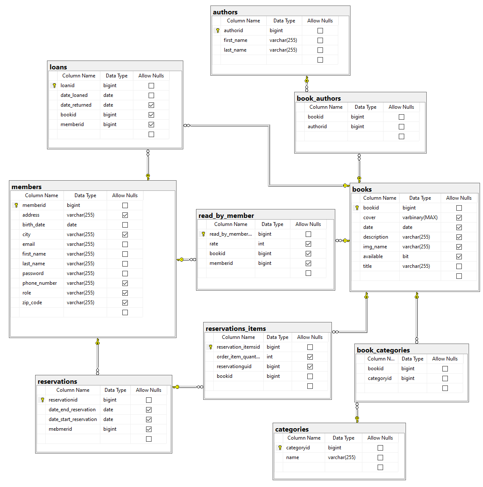

# Urban Library


## Table of contents
* [General info](#general-info)
* [Technologies](#technologies)
* [Features](#features)
* [Database](#database)


## General info
Web app for managing urban library.
	
  
## Technologies
Project was created with:
* Java
* Spring
* Angular
* HTML
* CSS
* Bootstrap


## Features
* make book reservations
* search for books by name/categories/authors
* keep track of books you want to read


## Database



## Setup
To run this project, install it locally using npm. Requirements: Angular, node.js

```
$ npm install
$ ng serve -o
```
